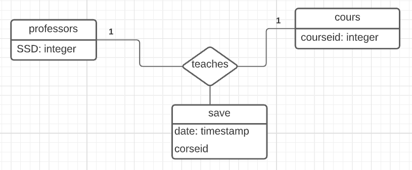

# Une base de données universitaire

Une base de données universitaire contient des informations sur les professeurs
(identifié par le numéro de sécurité sociale ou SSN) et les cours
(identifié par courseid). Les professeurs donnent des cours; chacun de
les situations suivantes concernent l'ensemble de relation `teaches`.

## Diagramme ER

Pour chaque situation, modèlez un diagramme ER qui le décrit
(en supposant qu'aucune autre contrainte).  Voici un gabarit pour
votre diagramme.

1) Les professeurs peuvent enseigner le même cours sur plusieurs semestres et seule la plus récente doit être enregistrée.

2) Chaque professeur doit enseigner un cours.

3) Chaque professeur enseigne exactement un cours (ni plus, ni moins).

4) Chaque professeur enseigne exactement un cours (ni plus, ni moins), et chaque cours doit être enseigné par un professeur.

5) Les professeurs peuvent enseigner le même cours sur plusieurs semestres et chaque doit être enregistrée.

6) Supposons maintenant que certains cours puissent être enseignés conjointement par une équipe de professeurs, mais il est possible qu'aucun professeur dans une équipe ne puisse enseigner le cours. Modélisez cette situation en introduisant des ensembles d'entités et des ensembles de relations supplémentaires si nécessaire.

## Diagramme de relation

Avec les diagrammes ER ci-dessus, modèlez un diagramme relationnel pour les systèmes.

## Schèma de relation

Avec les diagrammes relationnel ci-dessus, écrivez un schéma SQL relationnel pour les systèmes.

